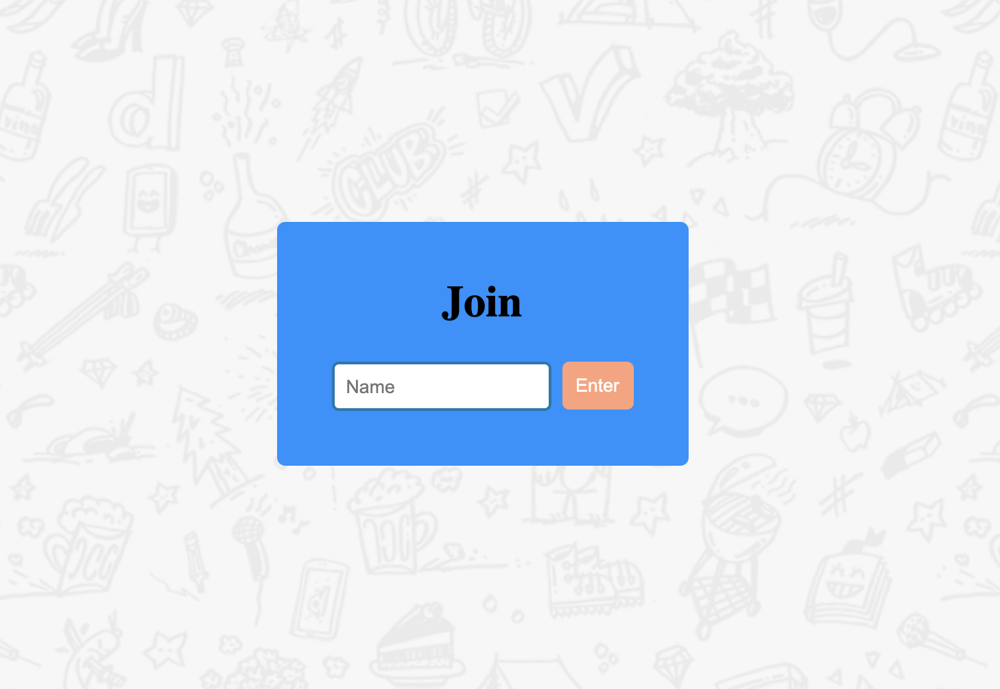
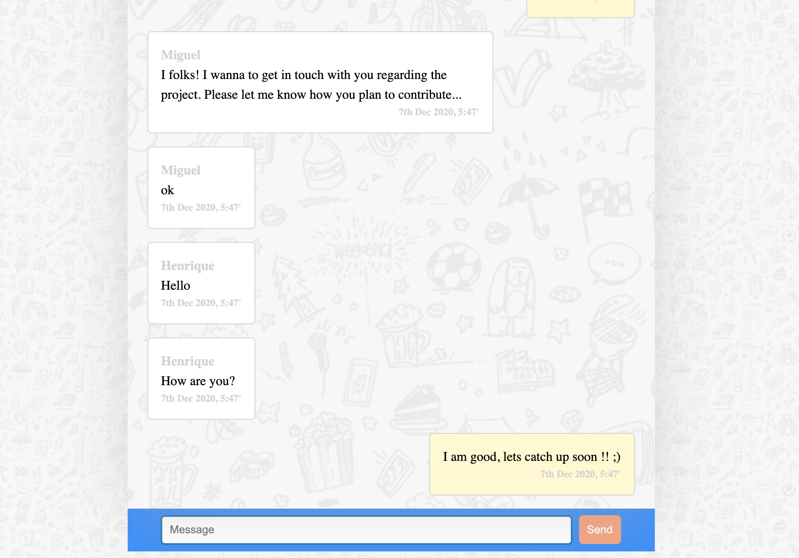
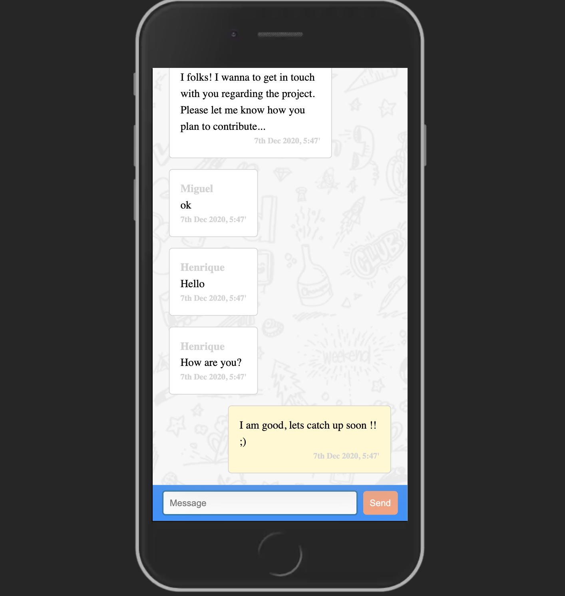

# Overview

A simple chat interface built with create-react-app. It is composed of 4 functional components:

- Join - Component where users insert their name to have access to the chat.
- Chat - Component where all the requests to the API happen and it displays the ChatForm and the MessageCard component
- MessageCard - It displays the messages content on the right or left, depending on the name property received.
- ChatForm - Displays the chat form where the user can type and send messages.

### Dependencies

- moment: To format date
- react-router-dom: For page navigation

# Getting Started with Create React App

In the project directory, you can run:

### `yarn start`

Runs the app in the development mode.\
Open [http://localhost:3000](http://localhost:3000) to view it in the browser.

## Images

